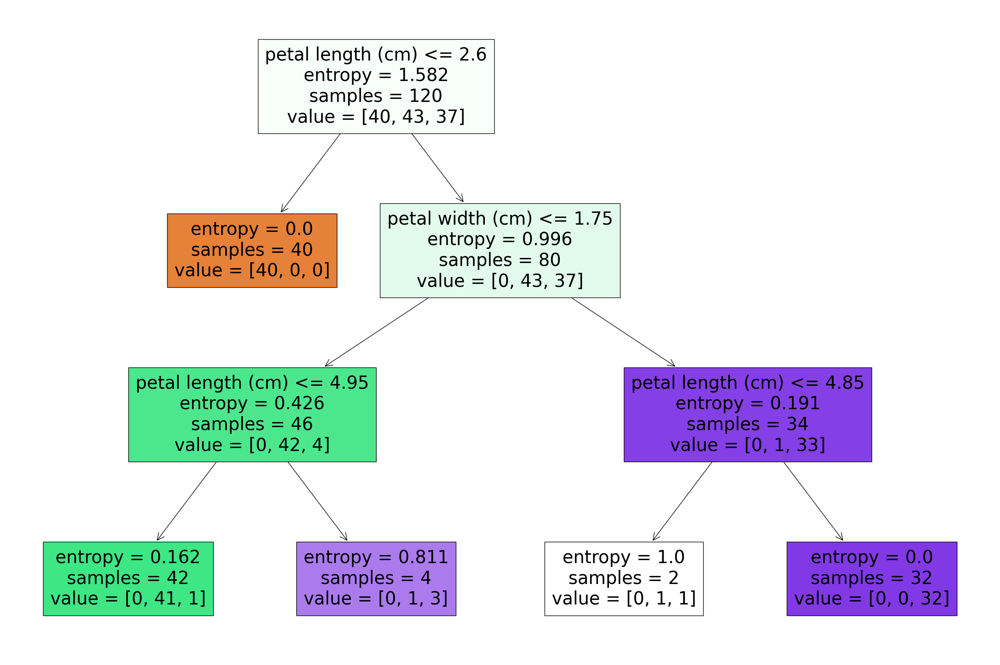

# Irissembly

## Buffer Usage Table

| 0-7 | 8-15 | 16-23              | 24-31               |
|-----|------|--------------------|---------------------|
| 0   | 0    | 0                  | Petal Length Lower  |
|     |      |                    | Petal Length Higher |
|     |      |                    | Petal Width Lower   |
|     |      | Comparison Results | Petal Width Higher  |
|     |      | Comp A Lower       | Sepal Length Lower  |
|     |      | Comp A Higher      | Sepal Length Higher |
|     |      | Comp B Lower       |                     |
|     |      | Comp B Higher      |                     |
